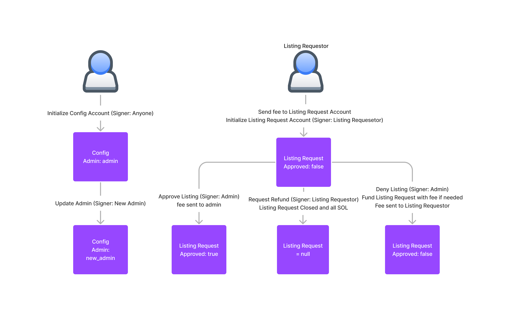

# Grape Art Marketplace - On-Chain Listing Request Program

This on-chain program allows a user to submit a request to be listed on an NFT marketplace. The user
creates an account containing meta-data about the collection. An admin can approve or deny the request. Ideally
the admin would be a DAO. A fee for requesting a listing is also supported.

## Listing request work flow



## Testing the program with a local validator

### Setup 

Install Anchor, a framework for building Solana programs, with the instructions found [here](https://book.anchor-lang.com/getting_started/installation.html|)

### Run tests

In the top-level directory run

```anchor test```